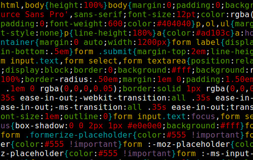

 # <h1 align="center"> Projeto - Website 1.0 </h1>
# 
Desenvolvimento do Projeto 1 - Programação Web Front-End 2024/02 AS62F N1

  

:space_invader:
  
:space_invader:
  
# Nome do website: FaculTech - Um guia para um ensino superior de qualidade 

# Integrantes do grupo:  
<markdown-accessiblity-table data-catalyst=""><table tabindex="0">
<thead>
  <tr>
    <th align="center"><a href="https://github.com/Luis-Spessoto"> Luís Felipe Spessoto</a></th>
    <th align="center"><a href="https://github.com/BrunoBiazon"> Bruno Circhia Biazon/sub></a></th>
    <th align="center"><a href="https://github.com/nieltom"> Nieltom Augusto</a></th>
    </tr>
</thead>
</table></markdown-accessiblity-table>

# Descrição do projeto: 
Website criado em função de difundir conhecimento acerca de onde podem ser encontrados cursos superiores, em tecnologia, em algumas universidades da região e/ou pós graduações à distância. Como proposta do website, criaremos uma interface que se assemelha a mesma do Windows 98, trazendo um estilo retrô, mas com informações atualizadas. Desta maneira, estipularemos a funcionalidade de icones como botões que se funcionem como se o usuário estivesse navegando em seu computador.

# ODS: 
4. Educação de qualidade 

# Estrutura do projeto: 
Os arquivos HTML estarão em 

