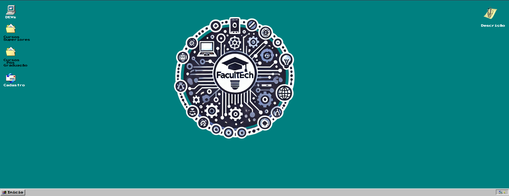

 # <h1 align="center"> Projeto - Website 1.0 </h1>
# 
Desenvolvimento do Projeto 1 - Programação Web Front-End 2024/02 AS62F N1

 <figure>
  
  <figcaption>Layout da página inicial do website</figcaption>
 </figure>

:space_invader:
  
:space_invader:
  
# Nome do website: FaculTech - Um guia para um ensino superior de qualidade 

# Integrantes do grupo:  
<markdown-accessiblity-table data-catalyst=""><table tabindex="0">
<thead>
  <tr>
    <th align="center"><a href="https://github.com/Luis-Spessoto"> Luís Felipe Spessoto</a></th>
    <th align="center"><a href="https://github.com/BrunoBiazon"> Bruno Circhia Biazon</a></th>
    <th align="center"><a href="https://github.com/nieltom"> Nieltom Augusto</a></th>
    </tr>
</thead>
</table></markdown-accessiblity-table>

# Descrição do projeto: 
Website criado na matéria de Programação Web Front-End, em função de difundir conhecimento acerca de onde podem ser encontrados cursos superiores, em tecnologia, em algumas universidades do Brasil. Como proposta do website, criaremos uma interface que se assemelha a mesma do Windows 98, trazendo um estilo retrô, mas com informações atualizadas. Desta maneira, estipularemos a funcionalidade de icones como botões que funcionem como se o usuário estivesse navegando em seu computador.

# ODS: 
4. Educação de qualidade 

# Estrutura do projeto: 
 Os arquivos HTML estão na parte inicial do repositório, onde são responsável pela estreturação das páginas. Temos o index, que é a página principal que imita o layout de um computador, o cursosGeral, que é onde estão listadas as universidades dentro de uma div que representa uma pasta, o cursosUTF, onde estão os cursos de tecnologia ofertados pela UTFPR, o cadLogin, que é a página de direcionamento para o cadastro e o login de usuários, o devs, onde estão as imagens que funcionam como links para direcionamento aos currículos dos desenvolvedores da página, o sobre, onde estão breves informações de qual a função do website, e por fim o soon, que é uma página temporária onde avisamos que algumas ferramentas ainda estão em desenvolvimento e serão entregues na próxima etapa do projeto. 
 Já os arquivos CSS, estão dentro da pasta CSS e são divididos em: cadLogin, que é o estilo da página de direcionamento para cadastro e login, o style, que é o estilo da página principal (index), o styleCursos, que é o estilo da pasta onde estão os cursos da UTFPR (cursosUTF), e por fim o  styleCursosGeral, que é responsável pelo estilo de todas as outras páginas realizadas. 
 Ademais, tempos uma pasta chamada "img/win98_icons" que é onde estão as imagens dos ícones utilizados, as imagens do perfil de cada um, o logo da FaculTech e a imagem do Campus da UTFPR utilizada na pasta dos cursos da UTF

